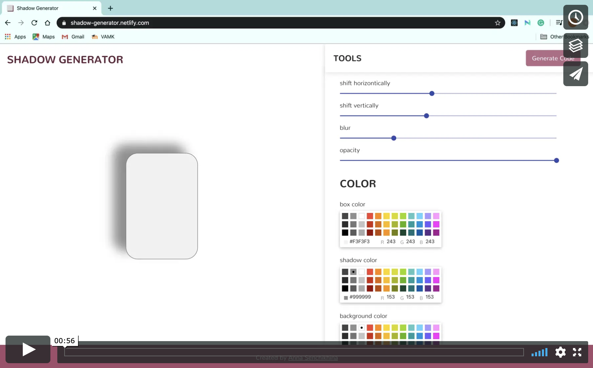

## Description

Shadow Generator is an app that is a tool for developers to generate CSS code for the shadow box.

## Demo link

[Open Demo Version](https://shadow-generator.netlify.com)

## Video demo

## Technologies and tools used

- JavaSctipt
  - React
  - Jest testing framework
- HTML
- CSS
  - Sass
- Material UI
- Netlify

## How to get locally

- git clone https://github.com/AnyaSen/shadow-generator.git
- npm install

## How to run

- npm start

## How to run tests

- npm test
